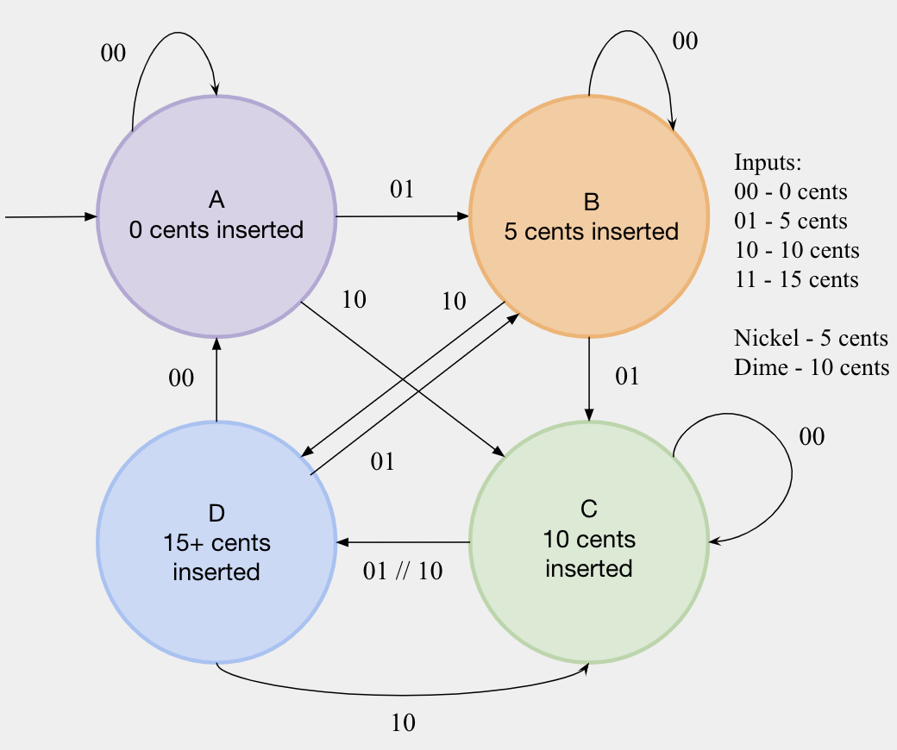
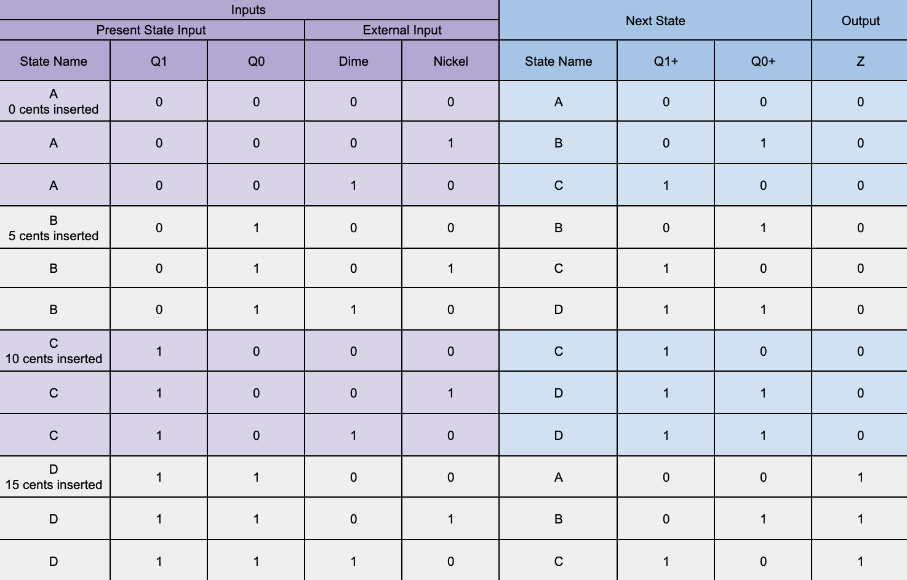
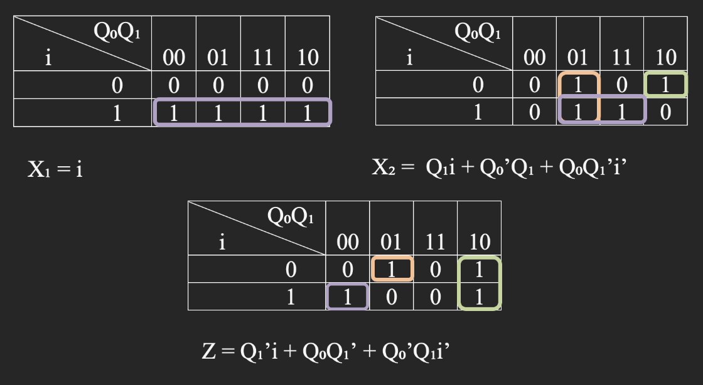

# ┌(・。・)┘♪ Gum Vending Machine System using Finite State Machine (FSM)

## What exactly is a 'Finite State Machine'? 💭
Now, a Finite State Machine (FSM for short) is a system where different inputs can alter the changes in each state present. Other examples of FSM include a ticket machine, an alarm clock, and many more.

#

## Components of the FSM ⚙️
Few things to note before I elaborate further on this FSM, this system won't remember change and the user can't request money back.

### States
There are 4 states in this case:

- State A: 0 cents inserted
- State B: 5 cents inserted
- State C: 10 cents inserted
- State D: 15 cents inserted

To further elaborate on the process of the Vending Machine utilizing FSM, here's a state diagram, along with the transition table and karnaugh maps, I put together:

### Transition Table

### Karnaugh Maps and Combinational Boolean Equations
These combinational boolean equations will come in handy in writing the code for the mylib.c to jot down the possible outcomes.

#

## Results & Visualisation:
